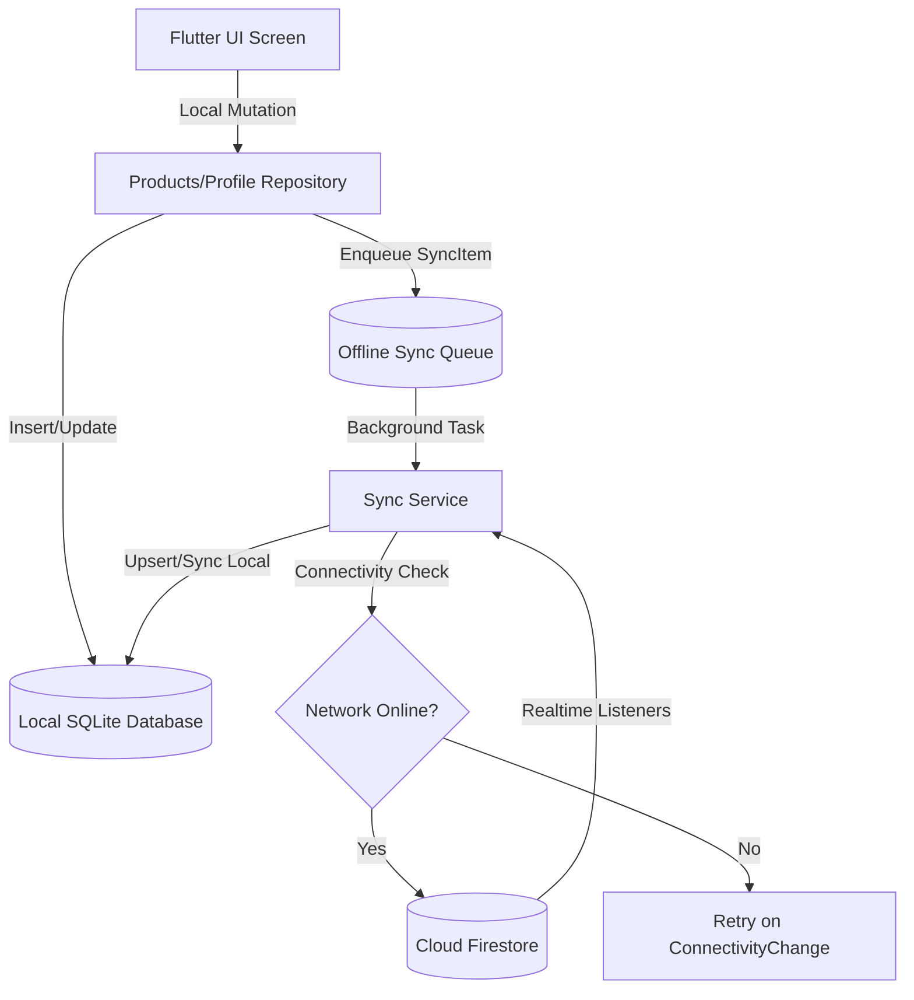

# 📦 Inventra — Premium Inventory Management System

[](https://flutter.dev)
[](https://firebase.google.com)
[](https://sqlite.org)
[](#)
[](#)

Inventra is a modern, cross-platform Inventory Management System engineered with Flutter. Leveraging an **offline-first local database architecture**, it provides seamless synchronizations with Cloud Firestore, barcode-scanning support, and automated reporting.

---

## 🗺️ Architectural Sync Flow

Inventra uses a local-first repository pattern with a transaction-buffered synchronization queue. This design guarantees consistent performance in offline environments and resolves replication conflicts gracefully upon network restoration.



---

## ⚡ Key Highlights

### 📁 Robust Storage & PDF Exports
- **Android Scoped Storage Support:** PDF reports are exported using native Android MediaStore APIs, saving reports to `/Downloads/Inventra` on API 29+ without requiring broad storage permission prompts.
- **Chrome Export Stability:** Keeps standard HTML download anchors active for Chrome/Web builds.
- **Validation-Driven Image Picker:** Validates chosen profile images/product details at the source level. Supports Camera/Gallery sources and filters by size (max 5MB) and format (`.jpg`, `.jpeg`, `.png`, `.webp`).

### 🔄 Offline-First Synchronization
- Operates on local SQLite tables for ultra-fast, offline UI responsiveness.
- Automatically pushes local change queues to Firebase Firestore when the device goes online.
- Subscribes to realtime Firestore stream changes to pull remote mutations into the local cache.

---

## 🛠️ Technology Stack

| Layer | Technology | Description |
| :--- | :--- | :--- |
| **Frontend Framework** | **Flutter (Dart)** | Unified Android and Web interface codebase. |
| **State Management** | **Flutter Riverpod** | Reactive, compile-time safe state observation. |
| **Local Database** | **SQLite (sqflite)** | Persistent offline storage with relational schemas. |
| **Cloud Database** | **Cloud Firestore** | Realtime document synchronization. |
| **Cloud Storage** | **Firebase Storage** | Profile avatars and product image buckets. |
| **Reporting API** | **Pdf (Dart)** | Native PDF document painting. |

---

## 📂 Project Structure

```bash
lib/
├── core/                  # Core global utilities, application routes, and themes
├── data/                  # Abstract models, sqlite providers, and raw models
├── features/              # Feature modules separated by clean logic layers
│   ├── analytics/         # AI-powered insights and metric trends
│   ├── categories/        # Catalog classifications
│   ├── products/          # Catalog management (add, edit, scan)
│   ├── reports/           # Valuation, alert, and momentum documents
│   └── settings/          # Identity profile & role postures
├── models/                # Globally-shared domain objects
├── services/              # API gateways, Firebase core, and Sync pipelines
└── main.dart              # Global execution launch point
```

---

## ⚙️ Installation & Setup

### 1️⃣ Clone the Repository
```bash
git clone https://github.com/heerpatel3737/Inventra.git
cd Inventra
```

### 2️⃣ Configure Environment Variables
Create a `.env` file in the root workspace directory matching the specifications below:
```env
FIREBASE_API_KEY=AIzaSy...
FIREBASE_APP_ID=1:1095661697697:web:...
FIREBASE_MESSAGING_SENDER_ID=1095661697697
FIREBASE_PROJECT_ID=inventra-9c9cc

GEMINI_API_KEY=AQ.Ab8...
GROQ_API_KEY=gsk_J2d...
GOOGLE_WEB_CLIENT_ID=1095661697697-...
```
> [!WARNING]
> Keep the `.env` file local and never commit it to public version control repositories.

### 3️⃣ Fetch Dependencies & Launch
```bash
# Get packages
flutter pub get

# Launch on connected device/browser
flutter run
```

### 4️⃣ Android Release Build
Compile an optimized release APK:
```bash
flutter build apk --release
```
The output package is generated under:
`build/app/outputs/flutter-apk/app-release.apk`

---

## 🔒 Firebase Rules Configuration

### Firestore Database
Ensure document writes are restricted to owner-scoped subcollections:
```javascript
rules_version = '2';
service cloud.firestore {
  match /databases/{database}/documents {
    match /users/{userId}/{document=**} {
      allow read, write: if request.auth != null && request.auth.uid == userId;
    }
  }
}
```

### Firebase Storage
Ensure storage resources are protected against unauthenticated operations:
```javascript
rules_version = '2';
service firebase.storage {
  match /b/{bucket}/o {
    match /users/{userId}/{allPaths=**} {
      allow read: if request.auth != null && request.auth.uid == userId;
      allow write: if request.auth != null
                   && request.auth.uid == userId
                   && request.resource.size < 5 * 1024 * 1024 // Enforce 5MB limit
                   && request.resource.contentType.matches('image/(jpeg|png|webp)');
    }
  }
}
```

---

## 👥 Authors & Contribution

Developed with ❤️ by **[Heer Patel](https://github.com/heerpatel3737)**. 

Contributions, bug reports, and features are welcome! Feel free to open issues or file pull requests to improve the system. If you like the project, please give it a ⭐!